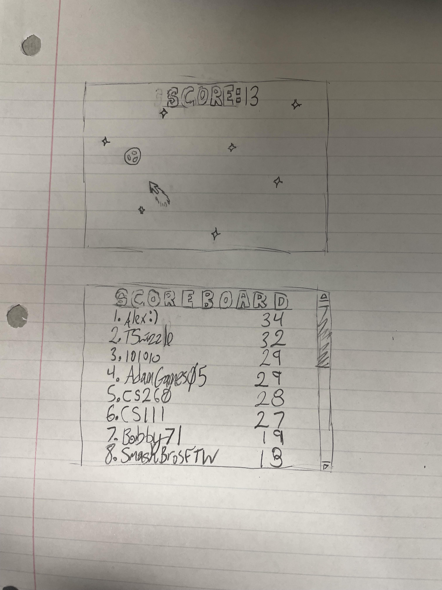

# Elevator Pitch

Is your reaction time abysmal? Mine is too! Do you want to prevent aging? I can't help you there. Introducing Cosmic Clicker Challenge!

# Key Features

- We check your reaction time by seeing how many asteroids you can click in a minute.
- You can compare your results to the competition after each round on a live updating scoreboard.

# How I'll Use Each Technology

- HTML > Without HTML we don't have a website.

- CSS > I'll use this to stylize my website.

- Javascript > This is how I'll implement my functionality/website logic.

- Service > I'll have end points of saving a user's high score.

- Database/Login > Users can login and their high score will be saved.

- Websocket > This is how I'll implement a live updating scoreboard.

- React > Apparently I'm reformating everything in React

# Rough Sketch

# HTML Deliverable

## HTML Pages

Three HTML pages that represent home/login, play, and scores.

## Links

The previously mentioned HTML pages are linked together in a navigation menu.

## Text

Related information is provided for each HTML page.

## Images

An asteroid is shot at during gameplay.

## DB/Login

Username and password are required to access the website.

## Websocket

At the end of each match, the scoreboard will update in realtime to reflect the top 10 highest scores.

## API Placeholder

Sun picture will be replaced with a space picture of the day from this API (https://github.com/nasa/apod-api)

# CSS Deliverable

## 30% Header, footer, and main content body

Header, main, and footer are properly separated

## 20% Navigation elements

Links got a color change

## 10% Responsive to window resizing

The website scales to window size

## 20% Application elements

Animated background

## 10% Application text content

Two fonts used

## 10% Application images

Border Radius applied to image on Scores page

# JS Deliverable

## 20% JavaScript support for future login.

Login brings you to Play.html and displays the username you entered.

## 20% JavaScript support for future database data.

Scoreboard data is stored and sorted at the end of each game.

## 20% JavaScript support for future WebSocket.

Scoreboard data is stored and sorted at the end of each game.

## 40% JavaScript support for your application's interaction logic.

The game works as intended.

# Service Deliverable

## 40% - Create an HTTP service using Node.js and Express

Node.js and Express used as intended

## 10% - Frontend served up using Express static middleware

Public directory loaded by middleware

## 10% - Your frontend calls third party service endpoints

NASA space image of the day called in scores.js

## 20% - Your backend provides service endpoints

Scores stored and provided on backend index.js

## 20% - Your frontend calls your service endpoints

submitscores and getscores called in play.js

# Login Deliverable

## Supports new user registration

Login/Sign Up Button on index.html page & authentication endpoint in the index.js file

## Supports existing user authentication

Login/Sign Up Button on index.html page & authentication endpoint in the index.js file

## Stores application data in MongoDB

Scores stored through the database.js file

## Stores and recieves credentials in MongoDB

Username, password, and token stored and recieved from MongoDB through the index.js and database.js files

## Restricts application functionality based upon authentication

Secure API router in the index.js file prevents unauthorized users from sending their scores or viewing the scoreboard
